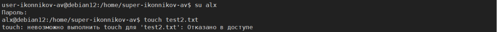

**Практическая работа №2 по дисциплине ТОИБ**

Ход работы:

### Скриншот 1

На скриншоте 1 представлен перечень выделенных виртальной машине (ВМ) debian12 системных ресурсов.

### Скриншот 2

На скриншоте 2 представлена графическая оболочка функционирующей ВМ debian12.

### Скриншот 3

На скриншоте 3 продемонстрировано создание пользователя super-{ФИО} и наделение его привилегиями суперпользователя.

### Скриншот 4

На скриншоте 4 продемонстрировано:
- переключение на созданного пользователя super-{ФИО}
- создание группы group-{группа}
- добавление пользователя super-{ФИО} в группу group-{группа}
- проверка наличия пользователя super-{ФИО} в группе group-{группа}

### Скриншот 5

На скриншоте 5 продемонстрировано:
- cоздание пользователя user-{ФИО}
- добавление пользователя user-{ФИО} в группу group-{группа}
- проверка наличия пользователя user-{ФИО} в группе group-{группа}

### Скриншот 6

На скриншоте 6 продемонстрировано наделение полномочиями пользователя user-{ФИО} по созданию и удалению файлов в домашнем каталоге пользователя super-{ФИО}.

Примечание:
1. chmod 770 /home/super-{ФИО}: Устанавливает полные права доступа владельцу и группе для /home/super-{ФИО}.
2. usermod -aG super-{ФИО} user-{ФИО}: Добавляет пользователя user-{ФИО} в группу super-{ФИО}.
3. chmod g+s /home/super-{ФИО}: Гарантирует, что любые файлы и директории, созданные в /home/super-{ФИО}, будут автоматически принадлежать группе super-{ФИО}, обеспечивая таким образом правильное распределение прав доступа.

На скриншотах 7 и 8 продемонстрирована работа механизма разграничения доступа.

### Скриншот 7

На скриншоте 7 видно, что пользователь user-{ФИО} может создавать и удалять файлы в домашнем каталог пользователя super-{ФИО}, так как ранее был наделен такими полномочиями.

### Скриншот 8

На скриншоте 8 видно, что самый первый пользователь системы alx не может создавать и удалять файлы в домашнем каталог пользователя super-{ФИО}, так как ранее не был наделен такими полномочиями.